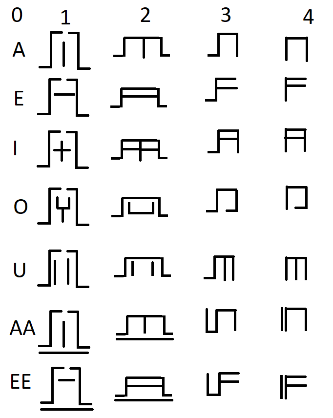
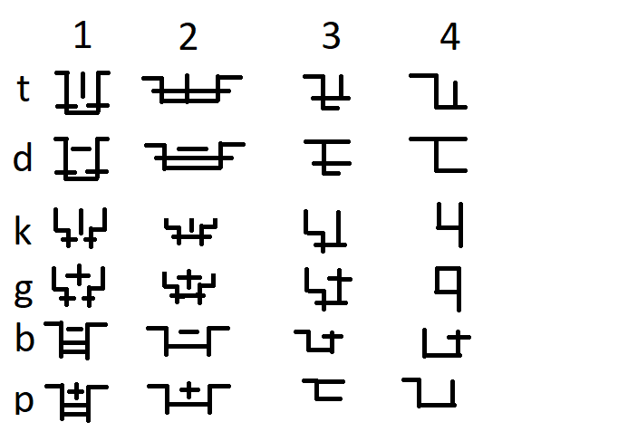
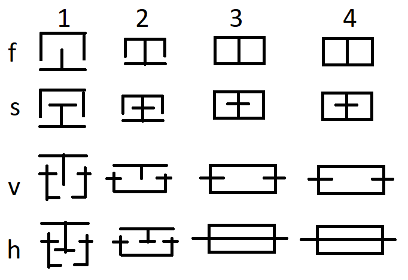
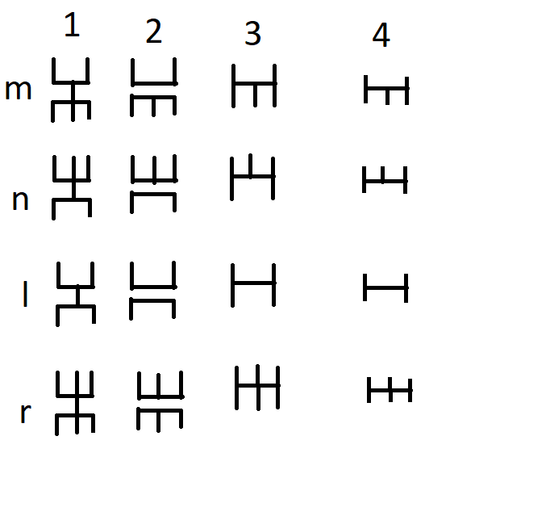

(Please forgive me the lack of proper terminology, structure etc.) 
**This project is heavily WIP and everything is subject to change**

# Design notes:
The language is supposed to reflect the nature of the species. 
This means that the sentences should be short and
contain as much information as possible, as Doguns speak slowly.  
I am also trying to make the language simple. I try to look at every feature and question why does it exist.

# Phonetics:
## Pronunciation:
For more information on pronunciation [click on this table](https://www.internationalphoneticalphabet.org/ipa-sounds/ipa-chart-with-sounds/).
### Vowels:
|       | near-front    | back                   |
|:-----:|:-------------:|:----------------------:|
| close | i /I/ ii /I:/ | u /u/                  |
| mid   | e /ɛ/ ee /ɛ:/ | o /o/ a /ʌ/ aa /ʌ:/ |

### Consonants
|                         | bilabial    | labio-dental | alveolar    | velar       | glottal |
|:-----------------------:|:-----------:|:------------:|:-----------:|:-----------:|:--------|
| plosive                 | p /p/ b /b/ |              | t /t/ d /d/ | k /k/ g /g/ |         |
| nasal                   | m /m/       |              | n /n/       |             |         |
| trill                   |             |              | r /r/       |             |         |
| fricative               |             | f /f/ v /v/  | s /s/       |             | h /ɦ/   |
| lateral  approximant |             |              | l /l/       |             |         |

Unused letters: c, j, q, w, y, z 
Consonant categories:
- Vowels
- Plosives
- Fricatives
- Others

# Grammar (I think?):
## Word structure
- words in their base form should start and end with plosives  
  - yes: "Doheared"
  - no:  "Doheareh"
- vowels should alternate with consonants
  - yes: "satod", "Doheared"
  - no:  "stod",  "Doheard"

Basic for of word is noun, other types are determined via suffix.
| word type | suffix       |
|:------------:|:------------:|
| verb         | oh           |
| adjective    | <type>n      |

Live:
- noun: dod
- verb (to live): dodoh
- adjective (living): dodan
- possesive (live's + "of live"): adod

Good:
- noun: baak
- adjective
  - absolute: baaken
  - comparative (better): baakon
  - superlative (best): baakun

# Sentence structure:
Same as english for now

## Nouns:
### Plural:
Done via suffix "e"

### Possesive
Done via prefix "a"

## Verbs:
- structure is {tense}-{verb}{pronoun without "d"}
- negation is done by adding "n" before tense

### tenses
| tense              | prefix |
|--------------------|:------:|
| present simple     | --     |
| present continuous | --     |
| past simple        | --     |
| future simple      | --     |
| imperative         | --     |
| conditional        | --     |

TODO: Decide whether to use grammatical aspect to replace extra tenses

## Pronouns:
|                  | singular | plural       |
|------------------|:--------:|:------------:|
| 1st person (me)  | da       | daa/ daae |
| 2nd person (you) | de       | dee          |
| 3nd person       | di       | die          |
- 1st person plural:
  - whether the recipient of the speech/text is included
  - Example: friend tells you "We won the lottery!"
    - \+listener = you won too
    - \-listener = you didn't win

possessive pronouns have the prefix "a-" (my = ada)
 TODO: Possessive for other words
- either a pre/suf- fix, or something "of" someone

## Adjectives:
There are three types of adjectives:

| name        | suffix | description |
|:-----------:|:------:|:------------|
| absolute    | -en    | Describe a property of something |
| comparative | -on    | Describe a relation of something (to something) |
| superlative | -un    | Describe a property of something on the highest degree |

## Prepositions:
## Adverbs:
## Determiners:
## Conjunctions:
## Interjections:

# Vocabulary:
WIP

# Writing system:
## Alphabet:
Each column represents an iteration. First iteration is in the style of already existing letters used for ceremonial purposes, the fourth one is simplified for use in common writing. 
TODO: image styling + Vowel rename 

# Examples:
WIP
